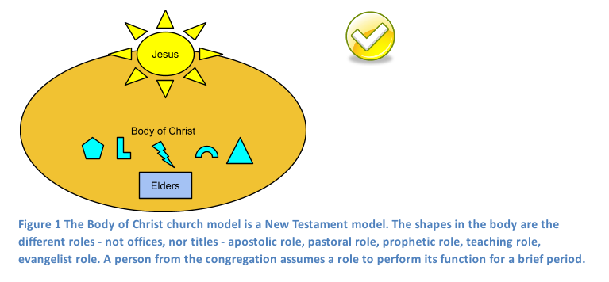

Are you frustrated in a church where it feels like the place of the believer is to give 10% of income, volunteer, attend classes, and make up the numbers for the services - even though the leaders are in denial about it? 

Are you in a church where the senior pastor
- preaches "look at me!!" sermons implicitly focused on him? of how he has the anointing, how God has used him...
- that he (not Jesus) is the head of the church
- do the followers of the senior pastor teach that to get blessings, one must bless the senior pastor and his family with money gifts and serve him?
- is there tight control over the microphone?
- any insight shared with him that you received in your own study of the Bible, any questioning or suggestion of possible misinterpretation of what the Bible teaches is taken as unwelcome correction - not as edification or a positive contribution.

I would like to start a different kind of church. So far, God has not given me direction to do so, nor do I have anyone else to start such a church with.
But if you feel led, please start such a church. I believe it is a healthy church model.

After attending evangelical churches in the USA for 23 years, I am disillusioned and cynical. 
Pastor-directed church models encourage exploitation and spiritual abuse of the people (congregation) by leaders. 
Furthermore, they tend to lead to pastor-centered churches. It is true that even the best model can be corrupted due to man's corrupt nature. 
Yet God wants us to pick a model that has the principles of the body of Christ.
Here, I describe My Dream Church from my study of the Bible.

My Dream Church does not exist. If you agree that the following points are Bible based and agree with them, why not pray and see if God wants you to start a Dream Church in your area? Or perhaps God wants you to take this to your pastor and if he agrees with it, there may be changes for the better - in your church.
Note: The following assumes you are a follower of Jesus. Here is a link to how you can become a follower of Jesus and part of God's family: http://goodnewsforyou.tripod.com

1. Structure: the structure of My Dream Church is based on the New Testament 'Body Of Christ'
                     model and not on the Old Testament hierarchical model.
2. Anointing: Every believer is a priest in the new covenant.
3. Biblical: submission to the Word in My Dream Church will be at a higher level 
                  than submission to leaders
4. Leaders should have secular jobs.
5. Finances: Giving not Tithing. Transparency in finances.
6. Praise and Worship is congregational.
7. Looking sideways (practical love).
8. Women are not silenced.

### 1. Structure: the structure of My Dream Church is based on the New Testament 'Body Of Christ' model and not on the Old Testament hierarchical model.

###### Head of the Church: Jesus Christ, not the senior pastor, is the head of the church.
"Christ also is the head of the church, He Himself being the Savior of the body
(Ephesians 5:23) "And he is the head of the body, the church". (Colossians 1:18)

###### The New Testament church is more like a wheat field than a banyan tree.
1.    a field of wheat

Jesus said in John 12, "unless a grain of wheat falls into the ground and dies, it remains alone. But if it dies, it produces a lot of grain". He also said, "the fields are ready for harvest" and the parable of the sower, "A farmer went out to sow his seed. As he was scattering the seed...".
2.    not a banyan tree

In India when I was growing up, the banyan tree (it also grows in Hawaii) is a familiar sight. It is a massive tree. It can occupy almost an acre and live for hundreds of years. Offspring grow down from its massive arms to form new trunks. However, there is one curious fact that I observed; no other tree grows under or near the banyan. Only grasses grow under it. I do not know why. Perhaps it absorbs so much nutrient and is the king of its domain, that no other tree can grow nearby.

##### The pastor-directed church model is an Old Testament model - is not for us.

Once the pastor becomes indispensable in the believer’s spiritual life, the belief is planted in the believer that ‘I need the pastor to get God’s approval, or to know God, or to have my prayers answered’. In the Old Testament model, this was correct because the ‘pastor’ was the intermediary between God and man. For Christians in the New Testament, this is heresy. This often leads to Spiritual Enslavement for Material Gain - Power, Money, and Control.

A healthy church model will embrace New Covenant principles, and the priesthood of the believer.

It is important to realize that any church model can become abusive since man is corrupt. 
However I believe that a healthy church model would have a structure similar to the following:
No senior pastor, but instead, is governed by elders. The spiritual duties are shared between the elders, pastors, teachers etc.
The elders should step down and new ones take over every 2 or 3 years. 
It is preferable that all leaders have secular jobs. Salaries should be part-time rather than full-time. Full-time salaries should be reserved for full-time evangelists. The Lord Jesus spent probably 80% of his life working as a carpenter. He stopped when he began evangelizing during the entire day, and every day. The apostle Paul worked with his hands in Ephesus, Corinth, Thessalonica and instructed the churches to do likewise. see this article.
Apostles, pastors, teachers, prophets, evangelists should be roles, not offices.

Again, it is important to understand that even if a church adopts a healthy church model like the one above, they may not actually implement it so. Human beings are sinful and can find the ‘loopholes’ to corrupt even a healthy model by not ‘walking the talk’. Things may look good in theory but the reality may be far different.

### 2. Anointing: Every believer is a priest in the new covenant.
(see diagrams above) 
Not offices nor titles: The shapes in the body are the different roles - not offices, nor titles - apostolic role, pastoral role, prophetic role, teaching role, evangelist role. A person from the congregation assumes a role according to his or her gifting, to perform its function for a brief period.
"A chosen people, a royal priesthood" (1 Peter 2:9). "…has made us to be a kingdom and priests to serve his God and Father" (Revelation 1:6). "you also, like living stones, are being built into a spiritual house to be a holy priesthood, offering spiritual sacrifices acceptable to God through Jesus Christ" (1 Peter 2:5) There is no hierarchy mentioned in the New Testament, except that the original apostles sorted out doctrine, and the elders governed in their local churches. “So Christ himself gave the apostles, the prophets, the evangelists, the pastors and teachers, to equip his people for works of service, so that the body of Christ may be built up” (Ephesians 4:11). The office of elder, deacon, pastor, bishop, evangelist, apostle, teacher seem to have been roles of service and shepherding rather than a seat in a hierarchy. In other words, the new covenant church was remarkably flat in organization. This is because every believer has the Holy Spirit. I John 2:20,27 speaks of every believer having the anointing. I was struck by the fact that in Acts, unlike in the Old Testament, the term anointed was not used of a specific individual(s), but rather phrases like "the Holy Spirit said, 'set apart for me...'  " when Saul and Barnabas were chosen in Acts 13:2. Only giftings are spoken of, not anointing of particular individuals. There was also no automatic dynastic succession. The temple is not the church building, but our own bodies ("know ye not that your bodies are the temple of God"). Together we form the body of Christ. Throughout the New Testament, service to the body - to each other is commended. Buildings are never even mentioned except as a location. The goal is not leadership, but service, preaching the gospel and changed lives through discipling and the power of God. See also FAQ below on Romans 12:4-8.
###### Taking hold of the power of the Holy Spirit. Laying of hands and praying.
Every believer should be encouraged to take hold of the power of the Holy Spirit - by being able to lay hands on, and pray for divine healing or breakthrough for a suffering person. ( In many churches, only the senior pastor lays hands and prays).

### 3. Biblical: submission to the Word in My Dream Church will be at a higher level than submission to leaders
(Apart from the standard doctrinal beliefs that most churches believe: http://www.vineyardusa.org/site/files/about/Vineyard%20USA%20Statement%20of%20Faith.pdf)

###### a) Berean church

In Acts 17:11, when Paul and Silas visited the Bereans, they "received the message with great eagerness and examined the Scriptures every day to see if what Paul said was true". They knew he was an apostle with authority sent by the Jerusalem apostles. Yet, they placed submission to the Word at a higher level than submission to leaders. Now look at this: Paul was not insulted. The Holy Spirit (through Luke, the writer of Acts) commends them and holds them up as an example. "…the Bereans were of nobler character". Psalm 138:2, "You have exalted above all things your name and your word."

###### b) There are 3 possible attitudes from the leadership or levels towards someone validating the message with the Word
1. suspicion and resentment  
2. tolerance  
3. encouragement

I believe that this is also one indicator of the level of spiritual maturity of a church.

###### c) I believe that most churches are at level 1.

I perceive that personal loyalty to the senior pastor is most important especially in pastor-driven churches. Submission to leaders is placed at a higher level than submission to the Word. Anyone who asks questions and attempts to validate with the Bible what is taught or practiced is treated with suspicion and resentment especially when there is discrepancy. It seems like we are forever attending classes and learning. How many people are going out to get new converts themselves, or to disciple outside the church? Do people study the Bible by themselves and pray? They have little reason to - if only pastor brings a word from God, and shares it with the church. All these make me believe that we are at the first level.

###### d) what happens where this principle is practiced (level 3)

It may seem like rebellion to say that, "our submission to the Word should be at a higher level than submission to our leaders"; the leaders may feel insecure of their position. However if you reflect on it, it is not so. In fact, it is the best way because it is God's way. Based on this, the church will respect their leaders and not back-stab ("do not speak evil of the ruler of your people"). They will not conspire nor form factions. They will submit to authority because it is in the Word. They will boldly hold their leaders and each other to the standard in the Word. The church body will themselves be strongly rooted in the Word and grow strong. It is not one-way, but reciprocal. When the leaders genuinely uphold that "our submission to the Word should be at a higher level than submission to our leaders", because of this they will prove trustworthy and righteous. When the people know this principle is genuinely true of the leaders then the church body knows they can trust them. Because they know that every effort is made by the leaders to conform to what is written, and that hidden sins do not remain hidden but are confessed and repented of. More than anything, each believer will rise up and occupy their niche. They will become strongly rooted in the Word, they will have the power of God in their lives.

### 4. Leaders should have secular jobs:
There are numerous passages in the NT to show that everyone had secular jobs (1 Thessalonians 4:11 "each of you should work with his hands") - this included Paul, Silas, Timothy. Only full-time evangelists were supported financially (1Corinthians 9:14 “the Lord has commanded that those who preach the gospel should receive their living from the gospel”). Jesus worked as a carpenter or stone mason (‘tekton’) for likely over 80% of his career. When he became a full-time evangelist, he was supported financially.

As mentioned above, apostle, evangelist, pastor, teacher are roles for service rather than positions in a hierarchy. According to this, pastors and staff should not work for free - they should be paid for their work, but part-time. Having a secular primary job lets them practice and demonstrate what a good employee is like, in the outside world. It also reduces the pressure on him for his financial needs and for his family. Working part-time in the church allows sharing of the spiritual work with the rest of the members.

In the Old Covenant, priests did the spiritual work (God resided in the temple).  The rest supported them financially. In the New Covenant, everyone is a priest and supposed to do spiritual work because all believers have the Holy Spirit. 

### 5. Finances: Giving not Tithing. Transparency in finances.
New Testament Christians are not required to tithe (give 10% of their income to the church).
Giving is freewill; however it must be regular, generous, proportional to income and cheerfully given. 
If every follower of Jesus is a priest, then our giving should go to help support the ‘priests’ who are in need.

2 Corinthians 9:7 "Each man should give what he has decided in his heart to give, not reluctantly or under compulsion, for God loves a cheerful giver.". Jesus commanded his church to practice Love, Baptism, Communion,  Conflict-resolution (Matthew 18), and Preaching the Gospel. He never asked his church to tithe!

|     |      |
| :----- | -----: |
| Old Testament ---->  | New Testament |
| Tithing ----> | Freewill Giving |
| Animal Sacrifices ----> | Living Sacrifice (our bodies) |
| Physical Circumcision ----> | Circumcision of the Heart |

    
Resources proving that tithing is not for today (http://www.tithing-russkelly.com/, John MacArthur http://www.gty.org/resources/questions/QA144).
Commit to transparency in finances. Reveal details of expenses and not roll them into larger headings which avoids scrutiny.

### 6. Praise and Worship is congregational:
In the Old Testament, praise and worship was controlled by certain anointed ones; Miriam, the sons of Kohath and others.
Since the body of Christ everyone has the anointing, praise and worship should be participatory. It is not just a praise and worship team that must lead, in a carefully choreographed performance.
Perhaps after a few songs led by the team, anyone who is a member and filled with a desire to worship and praise God, and feels the Holy Spirit leading him or her to do so, can start a chorus, hymn or praise song with everyone joining in; or pray or read a passage from the Bible or speak briefly about what God has shown him in the Word or speak a word or revelation (after it is cleared beforehand by those with the gift of discernment). These are not performances nor sermons nor teaching, but must be praise. The elders should preach, not just the senior pastor. Not out of routine, but when they are filled with the Holy Spirit and God has taught them something from the Word.
What I described is essentially congregational worship.
It is the right of every member of the church, not simply those who are spiritually gifted or those with titles and positions.
Note: to prevent abuse of this freedom, if anyone gets up and speaks departing from the guidelines above, then the leaders can ask him to sit down.

###### a) 1 Corinthians 14:26

"When you come together, everyone has a hymn, or a word of instruction, a revelation, a tongue or an interpretation. All of these must be done for the strengthening of the church".
Note that 

1) this is when the church meets together, and not in a small group meeting.
2) it is ‘everyone’, not just a chosen few.
3) it is a prayer (vs 14,15), praise song, a teaching, a sharing of what God has shown backed by the Word, prophecy, tongue, and the interpretation. It is the exercising of both natural and supernatural gifts.
4) All this must happen for the church to be strengthened. If you want your church to be strengthened - all the believers, not just a few - then all of the above should be encouraged, for everyone, and there should be a time in which this can be practised during the main meeting. This can be interpreted as a promise.

###### b) 1 Peter 2:5

"you also, like living stones, are being built into a spiritual house[Or into a temple of the Spirit] to be a holy priesthood, offering spiritual sacrifices acceptable to God through Jesus Christ."
In churches perhaps from a desire to control, or inexperience with the concept, leaders insist this must be done in a small group and that only pastors can speak in a service. This is not biblical.

###### Notes:

a) There was no mike at the front in our churches in India during participatory worship. People stood up at their seats to pray, or start a song or share something from the Bible related to praise of God. This enables even shy people to participate. Perhaps they can stand up and the cordless mike brought to them.

b) The best effects are when the worship is pointed towards God, rather than man. It should also be linked to scripture. I feel that prayer, praise song, sharing something from the Bible related to praise of God has more of these attributes than (say) a testimony or dream or vision that does not reference any scripture at all.

1) referencing scripture provides us with a way to evaluate or verify what is being said. Otherwise if there is no way to verify, one can go into deception.
2) referencing scripture provides everyone with a shared common point from which others can also 'take off'.

c) Perhaps time limits can be observed by projecting a flashing square on the wall (easily implemented) after 2 minutes and flashing red after 3 minutes. Perhaps it can be done from PowerPoint.

### 7. Looking sideways (practical love):  
Jesus said, "Whatsoever you have done to the least of these among you, you have done to me". Jesus flatly commanded us to serve each other - to wash each other's feet. (John 13). In fact, he clearly says the blessings will come if we do so, "you will be blessed if you do them". In Luke 14, he tells us not to schmooze (the leadership or friends) to gain favor, but to be hospitable to those who cannot repay us, to "cast our bread upon the waters".

### 8. The role of women:
One-flesh ministry. Women are co-laborers when they are considered one-flesh with their husbands. For example, if a man is married and is an elder, then both husband and wife are considered as one elder.

##### Are women allowed to teach?

This is a controversial topic. The apostle Paul says in 1 Timothy 2:8-15, “I do not permit a woman to teach or to assume authority over a man”. 
My personal interpretation is:

a) Paul elsewhere makes blanket statements, “Cretans [inhabitant of island of Crete] are always liars, evil brutes, lazy gluttons. This saying is true.”, in Titus 1:12. Was it just a personal outburst or an absolute and eternal truth?

b) “I do not permit…” is a personal statement.
 
c) Deborah was a warrior leader, prophetess and judge of Israel for decades. She was definitely in authority over men. Huldah was a prophetess. Philip’s daughters prophesied.

d) There is continuity from O.T. to N.T. See the table in #5. If God did not want women to teach or have authority over men, then there would have been such a restriction in the O.T. too. we would have seen it throughout. 

    I) Since women did not lead or teach often in secular life, it was not due to a stricture from God, but women were illiterate and a weaker section of society.
    II) The O.T. priests were men only. But in the N.T., all believers are priests. There is no spiritual distinction between men and women being priests. “...nor is there male and female, for you are all one in Christ Jesus.” (Galatians 3:28) 

e) There was no such prohibition from Jesus. However, all the apostles were men.

f) My Christian journey has been blessed by the teachings of women like Kay Arthur and Alaine Pakkala.

g) Apostle Paul was very sensitive to the local culture - so that the gospel would be advanced. 
He quoted their writers and even from their mythology.
During a riot, even the clerk at Ephesus defended Paul saying he had not disrespected their goddess Artemis (Acts 19).
I believe that is why Paul required women to cover their heads and remain silent - because it was so in the local culture.

I do not know if women can be senior pastors (again, Old Testament model!) but I am convinced that they can teach and preach.

####Frequently Asked Questions:

###### 1) Hasn't God appointed a leadership structure in the church? (Romans 13, Ephesians 4).
Romans 13 is about civil government, not the church. (keywords: 'taxes', 'revenue', 'rulers', 'governing authorities')
Yes, there should be leaders in the church. However it does not state in Ephesians 4 or 1 Corinthians 12 that these are seats occupied by individuals  as permanent positions.
Rather they seem to have been different hats or functional roles occupied as needed.
Paul introduces himself as an apostle in his letters because he founded the recipients' churches. From reading Acts, we see that he wore
many hats; apostle, evangelist, prophet, pastor, teacher and tent-maker.
Question to ask; does the present leadership structure of a church empower the body of Christ, and strengthen the ‘priesthood of the believer’ or does it seek to control it?
Unfortunately, many churches are tightly controlled by a small group of friends.
Leaders are required for doctrine, strategic decisions, how to spend the money, disciplining and accountability. Leaders should not take away spiritual functions that are the privilege of every member.

###### 2) You are looking for a house church.
Just because the churches in the New Testament were house churches and may have done things a certain way, does not mean churches today should be the same and follow their mechanisms exactly.
I think principles are more important than mechanisms.
Jesus rebuked the Pharisees many times for following mechanisms and ignoring principles.
It is important that the principles of the body of Christ and  priesthood of the believer be followed regardless of the mechanisms.
Again, the question to be asked is, ‘Does the mechanism reinforce the principle, or weaken and even nullify it?’
I feel the structures in today’s churches, especially for praise and worship; weaken the ‘body of Christ’ principle.

###### 3) Your pattern for praise and worship will work only in a small group.
This pattern for congregational worship is used in Plymouth Brethren churches. Bethesda Assembly in Bangalore is a regular church with a weekly attendance of over 200, and it has worked for almost a century there.
Another church where the same pattern is also followed is Good News Bible Center, Secunderabad of the Church of South India denomination. It had probably 200 members when the author was saved there.

###### 4) What about the spiritual gifts in Romans 12?
Romans 12. vs 4 For just as each of us has one body with many members, and these members do not all have the same function, 5 so in Christ we, though many, form one body, and each member belongs to all the others. 6 We have different gifts, according to the grace given to each of us. If your gift is prophesying, then prophesy in accordance with your[a] faith; 7 if it is serving, then serve; if it is teaching, then teach; 8 if it is to encourage, then give encouragement; if it is giving, then give generously; if it is to lead,[b] do it diligently; if it is to show mercy, do it cheerfully.

One can interpret this passage in light of the Old Testament model, or the New Testament model.
The OT model says if your gift is prophesying, then have the title of prophet and occupy the position of prophet. If it is to serve, then serve in the traffic, childcare, cooking, janitorial cleaning of toilets and building, usher, sound booth, lawn mowing etc. If it is teaching, then become a Bible study teacher in the small group, or a teaching pastor, if it is leadership, then join the leadership team (elders, board of trustees, deacons, pastors), and so on... 

There are a few problems with this view:

1) If Bob's gift is not healing, then if Tim comes to him sick, he cannot lay hands and pray for him because he does not have the gift of healing. Similarly, if Bob hears from the Holy Spirit, then it cannot be from God, because he is not a prophet. Bob should seek out one of the prophets of the church. If Bob is not a teacher, then he cannot teach what God has shown him in the Word, this past week.
In other words, it discourages the lay congregation from stepping into the power of the Holy Spirit that is available to us all. It says that only a select few are anointed - the rest can sign up to serve, give etc. Of course, this is false - 1 John says we are all anointed.
Must only those who have the gift of healing lay hands and pray for the sick? Jesus disproved it when he said that all believers must do so.
Mark 16:17 “And these signs will accompany those who believe: In my name... they will place their hands on sick people, and they will get well.”

2) How will you interpret the gifts of encouraging, mercy, serving, giving in verses 7,8? There is no title nor office for these. Instead it is everyone's duty to give, serve, encourage, be merciful.
As a practical observation, leaders, teachers, apostles and the other positions, rarely if ever, leave their positions to do menial, lower status work.

In contrast, the NT model encourages every believer to lay hands on and pray for the sick, to hear from the Holy Spirit, to preach the gospel, to teach someone a truth God has shown her, to give, to serve, to encourage etc. I believe Romans 12 is actually saying, if you have a gift in an area, then exercise it to the maximum extent so that you will benefit others. Do not be lukewarm about it. Note the keywords: generous, cheerful, diligent.
The apostle Paul applied this model to himself. He was apostle, pastor, teacher, evangelist, tentmaker (service), prophet, working healing and miracles, speaking in tongues, encouraging, giving, but he identifies his gift as apostle. 

###### 5) How are church workers and leaders paid?
Everyone should be paid only part-time and should have a secular job. Everyone who teaches must be paid for their work and time and effort in preparing. for instance if you spend 15 hours a week to prepare the sermon in addition to your regular job, then you should be paid well; 15 hours * $50/hour (say) = $750. However the preaching would be shared by the elders.

###### 7) Our church members are not mature enough.
This is an unfortunate remark because God is especially close to the new believer. For instance, every new believer can pray even if they are simple prayers.
